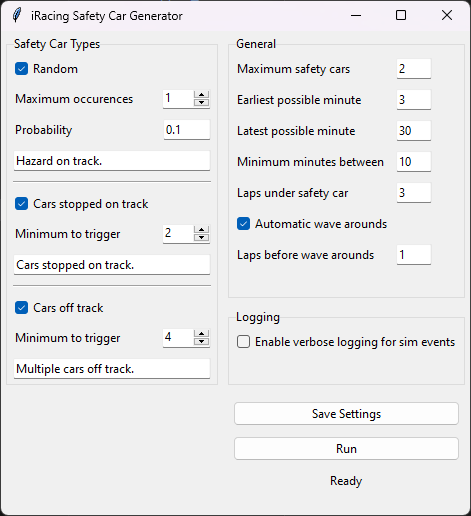

# iRacing Safety Car Generator

This program is designed to trigger safety car events in iRacing with more control than the built-in automatic yellows in iRacing, with adjustable settings.

## Getting Started

1. Download the latest release from the [Releases](https://github.com/joshjaysalazar/iRacingSafetyCarGenerator/releases) page.
2. Extract the ZIP file and run the executable.
3. Configure your settings in the application window (see [Settings](#settings) below), then click **Save Settings**. Your settings are saved to a file and loaded automatically next time you launch the app.
4. Launch your iRacing simulator session.
5. Once in the simulator, click the **Start SC Generator** button. The app should indicate it is "Connected to iRacing".
6. The app will wait for the race to start and then monitor for any of the incident thresholds to be met to throw a Safety Car event.

**Important:** Do not use chat while the generator is running as the app uses automated chat inputs to send commands to the simulator. When yellows are thrown, also make sure to not alt-tab around your running programs as iRacing will need to maintain focus to send the commands.

## Settings

### Safety Car Types

These settings control what types of incidents can trigger a safety car deployment. Each type can be independently enabled or disabled, and has its own message field that will be displayed to drivers when that type of safety car is thrown.

#### Random

Enables randomly occurring safety car events, independent of any on-track incidents.

| Setting                 | Description                                                                                                                              |
| ----------------------- | ---------------------------------------------------------------------------------------------------------------------------------------- |
| **Maximum occurrences** | The maximum number of times a random safety car could potentially occur (not guaranteed). This limit applies only to random safety cars. |
| **Probability**         | The probability of a single safety car deployment. A value of `0.1` indicates a 10% chance.                                              |

#### Cars Stopped on Track

Triggers a safety car when a certain number of cars have stopped on the racing surface (not in pits).

| Setting                | Description                                                              |
| ---------------------- | ------------------------------------------------------------------------ |
| **Minimum to trigger** | Minimum number of stopped cars on track required to deploy a safety car. |

#### Cars Off Track

Triggers a safety car when a certain number of cars have gone off the racing surface.

| Setting                | Description                                                       |
| ---------------------- | ----------------------------------------------------------------- |
| **Minimum to trigger** | Minimum number of off-track cars required to deploy a safety car. |

### Threshold Checks

These settings fine-tune how incidents are evaluated before triggering a safety car.

#### Event Time Window

The time window (in seconds) used to consider recent events for threshold calculations. Events older than this window are discarded. This means incidents need to happen within this time frame of each other to count together toward triggering a yellow.

#### Race Start Multiplier

At the start of a race, incidents are more common due to the packed field. The multiplier increases the thresholds temporarily to avoid false positives.

| Setting                    | Description                                                                                                       |
| -------------------------- | ----------------------------------------------------------------------------------------------------------------- |
| **Race Start multiplier**  | The factor by which the off-track and stopped-car thresholds are multiplied at race start. Set to `1` to disable. |
| **Multiplier active time** | Time (in seconds) for the race start multiplier to remain in effect.                                              |

#### Proximity-Based Yellows

When enabled, only incidents where cars are close together on track are considered. Scattered incidents across the track won't trigger a safety car.

| Setting                | Description                                                                                                                                     |
| ---------------------- | ----------------------------------------------------------------------------------------------------------------------------------------------- |
| **Proximity distance** | The percentage of a lap used for proximity grouping. `0.05` = 5% of the lap. Do not set above `1`, as that will effectively disable this check. |

#### Combined/Weighted Yellows

Enables a combined threshold that counts both off-track and stopped cars together, each multiplied by a configurable weight. This is independent of the individual off-track and stopped car triggers above, meaning you can use combined yellows alongside or instead of the individual triggers.

| Setting                | Description                                                        |
| ---------------------- | ------------------------------------------------------------------ |
| **Combined threshold** | The weighted score at which a yellow will be thrown.               |
| **Off-track weight**   | Multiplier for the number of off-track cars in the combined score. |
| **Stopped weight**     | Multiplier for the number of stopped cars in the combined score.   |

### Eligibility Window

These settings define when safety cars are allowed to be deployed during a race.

| Setting                      | Description                                                                     |
| ---------------------------- | ------------------------------------------------------------------------------- |
| **Maximum safety cars**      | Maximum number of safety car deployments allowed during the entire race.        |
| **Earliest possible minute** | Earliest time (in minutes after race start) a safety car can be deployed.       |
| **Latest possible minute**   | Latest time (in minutes after race start) a safety car can be deployed.         |
| **Minimum minutes between**  | Minimum time interval that must pass before another safety car can be deployed. |

### Safety Car Procedures

These settings control what happens after a safety car is deployed.

| Setting                   | Description                                                                                                                                                                                                                                                                      |
| ------------------------- | -------------------------------------------------------------------------------------------------------------------------------------------------------------------------------------------------------------------------------------------------------------------------------- |
| **Laps under safety car** | Number of laps the safety car remains deployed. A value of `0` lets iRacing control the number of laps automatically. **Note:** A value of `1` will be ignored by iRacing. The pace laps command is sent halfway around the lap to avoid closing pits while drivers are pitting. |

#### Automatic Wave Arounds

When enabled, the app sends wave-around commands to lapped cars after a configurable number of laps behind the safety car.

| Setting                      | Description                                                                                                                                                                                                                                                              |
| ---------------------------- | ------------------------------------------------------------------------------------------------------------------------------------------------------------------------------------------------------------------------------------------------------------------------ |
| **Laps before wave arounds** | Number of laps behind the safety car before wave-around commands are sent, counted from the safety car's out lap. A value of `0` sends wave commands the next time the leader crosses the start/finish line, which may not leave enough time for cars to tow and rejoin. |
| **Wave around rules**        | The method used to determine which cars get waved around:                                                                                                                                                                                                                |

Wave around rules options:

- **Wave lapped cars** - Anyone not on the same lap as their class lead gets waved.
- **Wave ahead of class lead** - Anyone ahead of their class leader in the running order behind the safety car gets waved.
- **Wave both (combined)** - Combines both methods: waves cars that are lapped OR ahead of their class lead.

#### Split Classes (Experimental)

When enabled, sends end-of-line (EOL) commands to sort the grid when classes are mixed up behind the safety car. This happens at the one-to-green signal and requires manual confirmation via a dialog before the commands are sent.

### Advanced Features

The **Advanced Features** checkbox in the controls panel reveals additional options:

- **Throw Double Yellows** - Manually trigger a safety car event while the generator is running.

## Documentation

This project includes documentation for different audiences:

- **[ARCHITECTURE.md](ARCHITECTURE.md)** - Technical architecture, system design, and workflows for developers
- **[CONTRIBUTING.md](CONTRIBUTING.md)** - Guidelines for contributing to the project (development setup, code standards, testing)
- **[docs/RACING_CONCEPTS.md](docs/RACING_CONCEPTS.md)** - Racing terminology and concepts
- **[.ai-context.md](.ai-context.md)** - AI coding assistant context (patterns, conventions, gotchas)
- **[.ai-modules.md](.ai-modules.md)** - Quick module reference for AI assistants

## License

This program is licensed under the [GNU General Public License Version 3](https://www.gnu.org/licenses/gpl-3.0.html).

## Author

This program was originally created by [Joshua Abbott Salazar](https://github.com/joshjaysalazar) and further developed by our awesome crew at [Broken Wing Racing League](https://discord.gg/GSECQHPqet)! Check out [CONTRIBUTING.md](CONTRIBUTING.md) to see how you can contribute and make it onto our Contributors list!

If you encounter any issues or have questions, please [report them on GitHub](https://github.com/joshjaysalazar/iRacing-Safety-Car-Trigger/issues).
